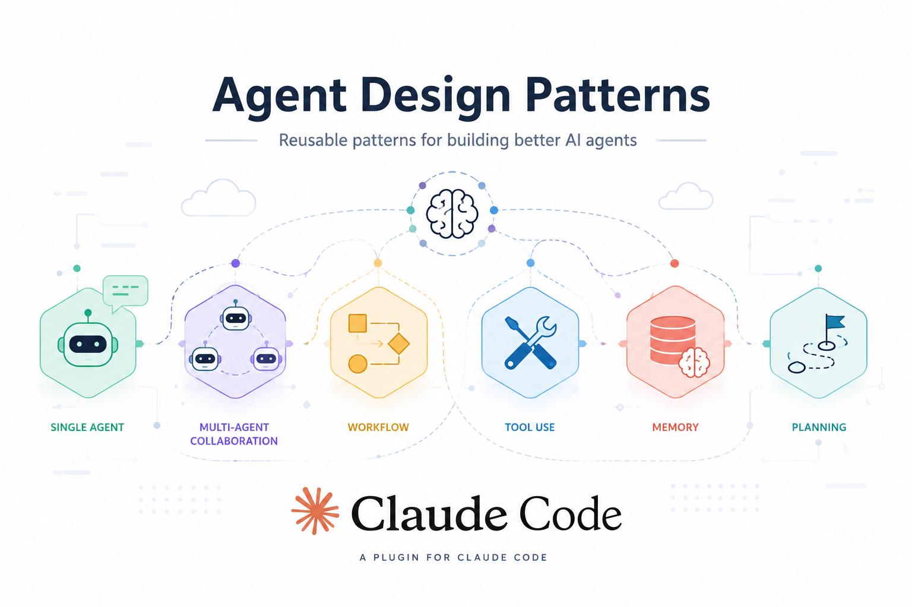

# agent-design-patterns

A Claude Code plugin that teaches the `agent-design-patterns` skill: how to structure a
multi-agent task as a `Workflow` using Google Cloud's validated agentic-AI design patterns.

This plugin is based on and inspired by Google Cloud's article
[Choose a design pattern for your agentic AI system](https://docs.cloud.google.com/architecture/choose-design-pattern-agentic-ai-system),
which the pattern markdown files map onto Claude Code's `Workflow` primitives.

## What it does

When you ask Claude Code to orchestrate a task across multiple subagents ("fan out", "run a
workflow for", "orchestrate this with subagents", "which agent pattern"), this skill picks the
control-flow shape that matches the task and points to a ready-to-adapt `Workflow` template:

| Task shape | Pattern | Primitive |
|---|---|---|
| Fixed ordered stages, each feeds the next | Sequential | `pipeline()` (1 item) |
| Independent subtasks, no shared state | Parallel | `parallel()` |
| Repeat until an exit condition / dry | Loop | `while` + `agent()` |
| Analyze, then route each part to a specialist | Coordinator | classify → `parallel()` by route |
| Big ambiguous task → decompose recursively | Hierarchical | `agent(plan)` → `pipeline()` over units |

Each pattern's markdown (`skills/agent-design-patterns/patterns/`) includes a copyable Workflow
template.

## Install

This repo is itself a plugin marketplace. Add it, then install the plugin:

```
/plugin marketplace add /Users/claudiomedeiros/Documents/agent-design-patterns
/plugin install agent-design-patterns@agent-design-patterns
```

(Or point `/plugin marketplace add` at this repo's GitHub URL once pushed remotely.)

## Structure

```
.claude-plugin/plugin.json      # plugin manifest
.claude-plugin/marketplace.json # marketplace manifest (lists this plugin)
skills/agent-design-patterns/
  SKILL.md                      # entry point: picks the pattern by task shape
  patterns/
    sequential.md
    parallel.md
    loop.md
    coordinator.md
    hierarchical.md
```
